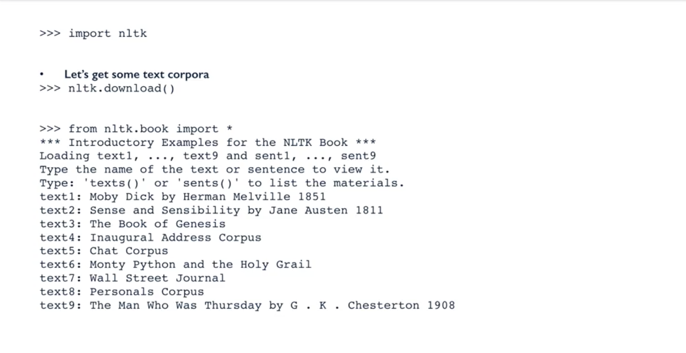
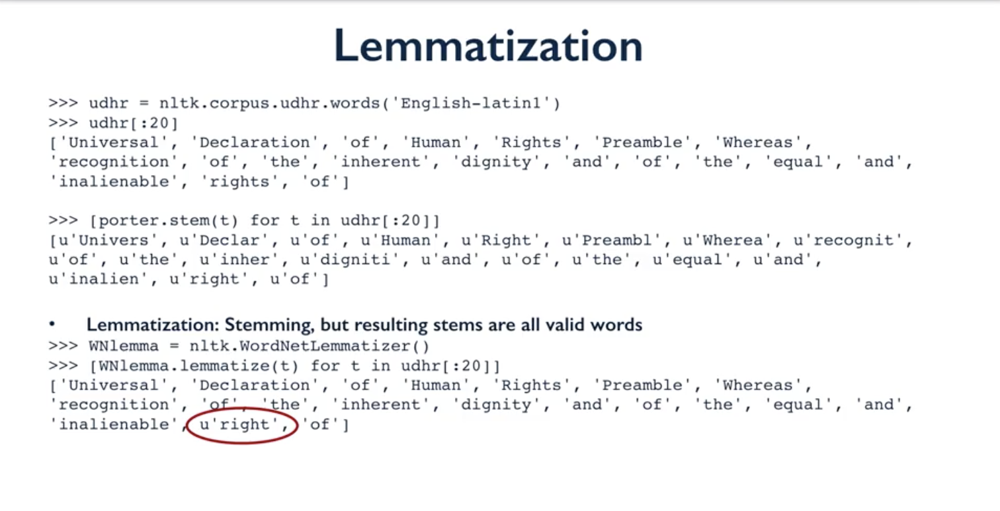
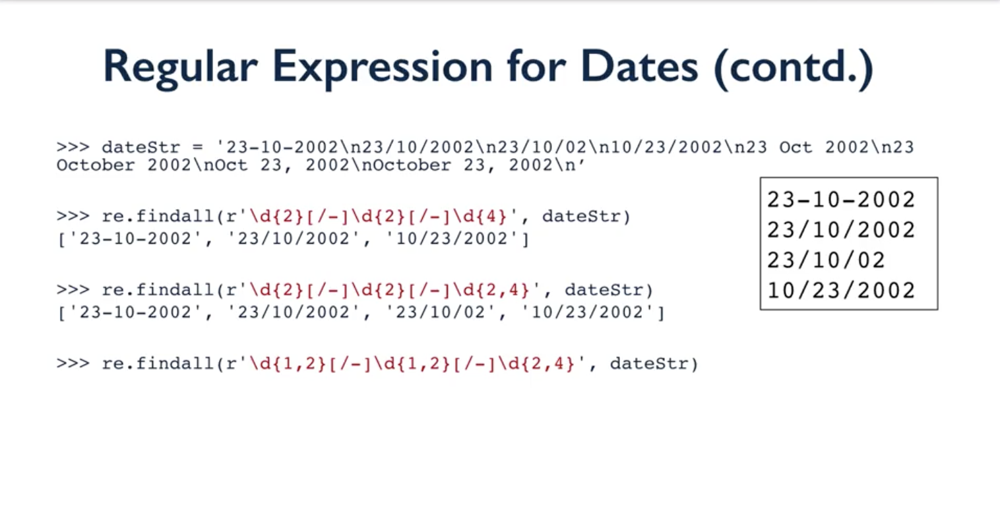
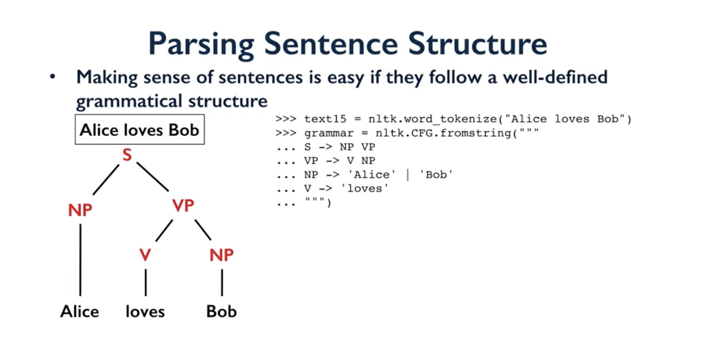
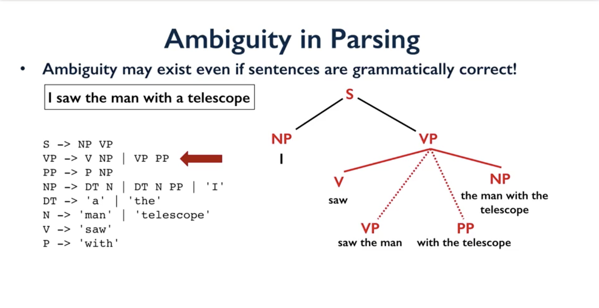
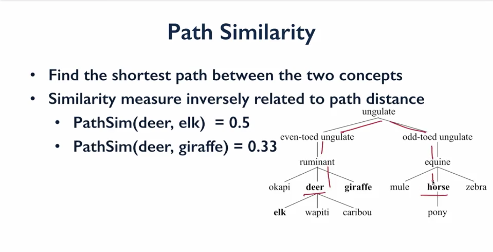
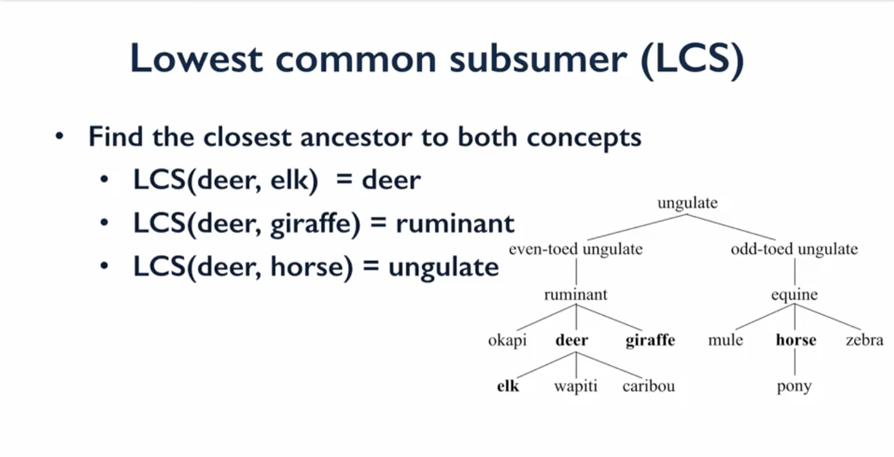

# 10강 - Natural Language Processing

## 0.Corpora, Stemming, Lemmatization and Tokenization

## 1. Lexical Analysis

## 2. Syntax Analysis

## 3. Semantic Analysis 

Slides from : [https://www.coursera.org/learn/python-text-mining/lecture/wWEVW/advanced-nlp-tasks-with-nltk](https://www.coursera.org/learn/python-text-mining/lecture/wWEVW/advanced-nlp-tasks-with-nltk) 

