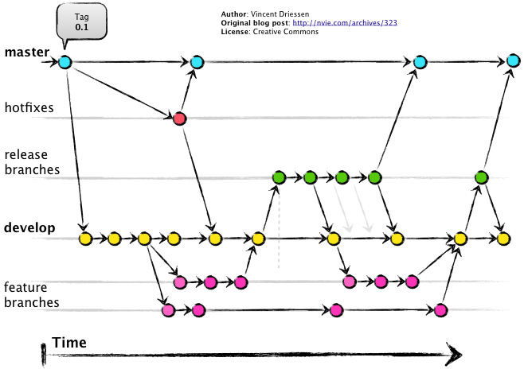

# 3강 - basics of python project

## 0. Updating Github repository

1. 바탕화면으로 이동 `cd desktop` 
2. 클론된 라페지토리로 이동 `cd python_study_SYL`
3. `git status` 를 통해서 nothing to commit, working tree clean 메세지 확인
4. working tree 가 clean하지 않다면, `git pull`
5. branch해서 다른 branch들도 확인하기, Figure 1을 참조한.  4-1 `git branch` 를 통해 어떤 branch들이 있는지 확인 가능 4-2 `git branch master`를 통해 master branch를 생성 4-3 `git branch` 를 통해 master branch가 생겼는지 확인 4-4 `git checkout master` 를 통해 master branch로 이동  4-5 local git repository folder를 오픈해서 자료가 없는지 확인 4-6 `git branch --set-upstream-to=origin/master master` 를 통해 origin \(remote\)저장소와 local의 master 브랜치를 연결 4-7 `git status` 를 통해 새로운 브랜치인 것을 확인 
6. 진행한 과제의 assignment1 폴더를 local git repository folder 다운로드 또는 이동/복사
7. add 하기 __`git add .`
8. commit 하기 __`git commit -m "initial commit"`
9. push 하기 __`git push origin HEAD:master`
10. ID, password 입력 후 종료



또는 해당 과정을 Github web interface를 통해  
1. add file 클릭   
2. upload file 클릭  
3. file drop-down 후 commit changes 클릭  
4. `make pull request`  
5. `merge pull request`  
과정을 통해서도 손쉽게 업로드 가능.

## 1. Commentary on the previous assignment

```python
import re
def logs():
    with open("assets/logdata.txt", "r") as file:
        logdata = file.read()
    y = logdata.splitlines()
    #print(y[0])
    name_list = list()
    dictionary_iter = dict()
    #for i in range(len(y)):
    for i in range(2):
        dictionary_iter['host'] = str(re.findall('.*[.][\d]* -',y[i]))
        dictionary_iter['host'] = dictionary_iter['host'][2:-4]
        #print(dictionary_iter['host'])
        dictionary_iter['user_name'] = str(re.findall('- [\w]* [[]',y[i]))
        if len(dictionary_iter['user_name']) == 2 :
            dictionary_iter['user_name'] = '-'
        else:
            dictionary_iter['user_name'] = dictionary_iter['user_name'][4:-4]
        #print(dictionary_iter['user_name'])
        dictionary_iter['time'] = str(re.findall('[[].*[]]',y[i]))
        dictionary_iter['time'] = dictionary_iter['time'][3:-3]
        #print(dictionary_iter['time'])
        dictionary_iter['request'] = str(re.findall('["].*["]',y[i]))
        dictionary_iter['request'] = dictionary_iter['request'][3:-3]
        #print(dictionary_iter['request'])
        name_list.append(dictionary_iter)
        name_list.append(i) 
    
    print(name_list)
    return name_list
    # YOUR CODE HERE
    raise NotImplementedError()
```

caution : `dictionary` is mutable  
we should use `.copy()` to return new dictionaries

```python
import re
def logs():
    with open("assets/logdata.txt", "r") as file:
        logdata = file.read()
    
    # YOUR CODE HERE
    logs = []
    pattern = """
    (?P<host>\d{1,3}.\d{1,3}.\d{1,3}.\d{1,3})
    (\s\-\s)
    (?P<user_name>\w+|-)
    (\s\[)
    (?P<time>\d{1,2}\/\w+\/\d{2,4}:\d{1,2}:\d{1,2}:\d{1,2}\s-\d{1,4})
    (\]\s")
    (?P<request>\w+\s[\/\w\-\+\S]+\s\w+\/\d{1}.\d{1})
    """
    
    for item in re.finditer(pattern,logdata,re.VERBOSE):
        logs.append(item.groupdict())
    
    return logs
    # raise NotImplementedError()
```

1. backslash changes meta character \(right after it\) into character and character into meta character.
2. ?P is an extension to basic regex.
3. \(\) is for grouping.
4. &lt;&gt; indicates keys from dictionaries.
5. `VERBOSE`option deletes whitespace and enables commentary. 5-1 But then, how do we express 'whitespace'? 5-2 it can be expressed as \s
6. `finditer` enables iteration.
7. `groupdict` returns a new dictionary every time.

```python
In [20]: id(m.groupdict())
Out[20]: 3075475492L

In [21]: id(m.groupdict())
Out[21]: 3075473588L
```

## 1. Feature of Jupyter Notebook

magic command 란 무엇일까요? Jupyter는 본래 IPython을 모태로 하고 있습니다. IPython은 Python + Shell의 사용성을 지향한 소프트웨어로서, Shell의 명령어를 Python에서 직접 활용할 수 있도록 합니다.   
따라서, 이러한 명령을 기존의 Python 언어를 사용하는 타 IDE인 Pycharm과 같은 프로그램에서는 사용할 수 없습니다.  
예를 들면, stata 소프트웨어 자체도 C언어로 짜여졌습니다. 다만, 그 안에서 사용하는 자체적인 규칙의 방향성이 다르고 우리는 이를 새로운 언어처럼 생각하고 있는 것이지요.   
반면에, R의 경우에는 그 자체로 Python과 C에 상응하는 '프로그래밍 언어'입니다.

```python
%%timeit -n 100
```

## 2. Comparison and Logical operators

## 3. Relational Database


  


