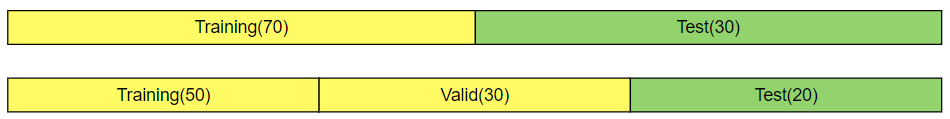
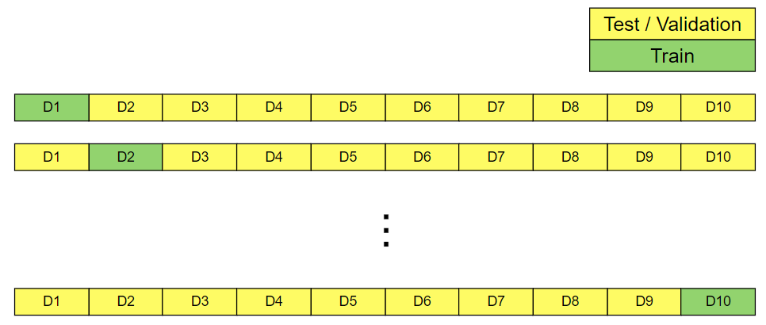
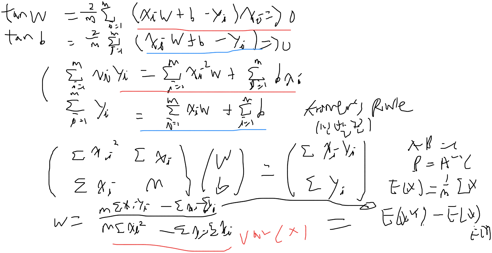
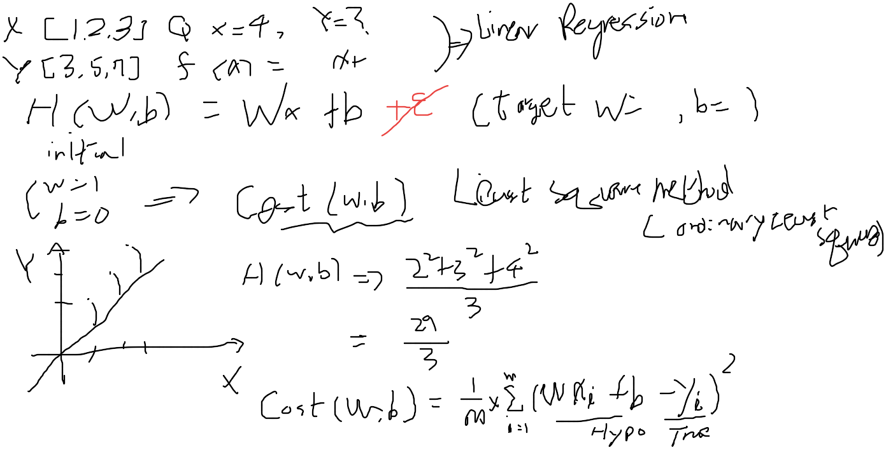
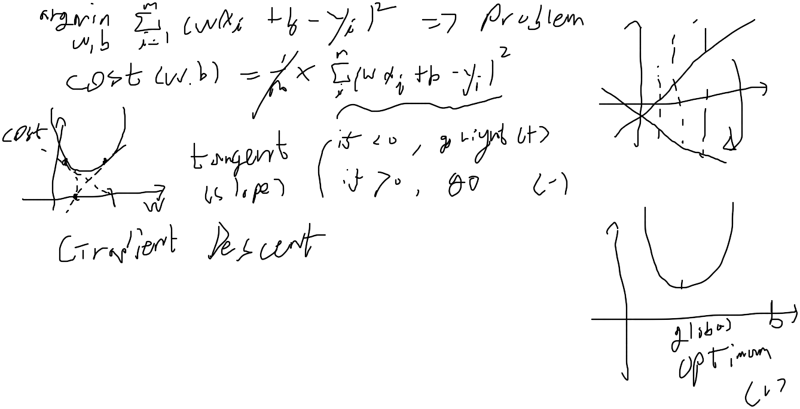
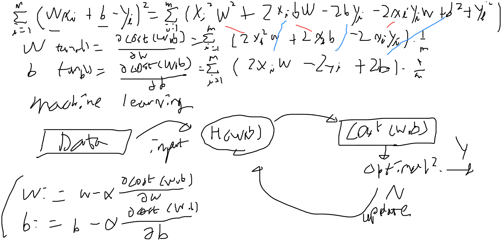

# 5강 - Advanced Python review

## 0. Schedule

~~Jan 26th, 27th~~   
Introduction week1 + assignment 1 due to Feb 2nd  
~~Feb 2nd,  3rd~~   
Introduction week2 + assignment 2 due to Feb 9th  
~~Feb 9th~~, 10th Machine Learning  
Machine Learning week1 + assignment 1 due to Feb 16th  
Feb 16th, 17th Text Mining  
Machine Learning week 1 + assignment 2 due to Feb 24th  
Feb 23th, 24th Text Mining  
Text Mining week 2 + there's no assignment

## 1. Commentary on the previous assignment

```python
def proportion_of_education():
    # your code goes here
    # YOUR CODE HERE
    # raise NotImplementedError()
    import pandas as pd
    df = pd.read_csv('assets/NISPUF17.csv', index_col=0)
    # selecting the needed column from the dataframe
    df_mother = df['EDUC1']
    total = df_mother.count()
    less_than_high_school = df_mother[df_mother == 1].count()
    high_school = df_mother[df_mother == 2].count()
    more_than_high_school_not_college = df_mother[df_mother == 3].count()
    college = df_mother[df_mother == 4].count()
    dictionary = {"less than high school": less_than_high_school/total,
                  "high school": high_school/total,
                  "more than high school but not college": more_than_high_school_not_college/total,
                  "college": college/total}
    
    return dictionary

proportion_of_education()
```

the proportion of education 만 볼 것이기 때문에 다른 attribute는 필요가 없어 'EDUC1'만 선택합니다. 이를 `count()`하면 전체 record의 수가 될 것이며. 각각을 교육 수준에 따라 1~4 로 masking 하고 `count()`합니다. 출력은 `dictionary`입니다.

```python
def average_influenza_doses():
    # YOUR CODE HERE
    # raise NotImplementedError()
    # selecting the needed column from the dataframe
    import pandas as pd
    df = pd.read_csv('assets/NISPUF17.csv', index_col=0) #load index as it is 
    # grouping the dataframe by whether breastfed or not (categorical) 
    df_cpf_01 = df.groupby('CBF_01')
    # get the representative value (average) of numerical attribute (P_NUMFLU) from the grouped category
    df_cpf_01_mean = df_cpf_01['P_NUMFLU'].mean() 
    
    return (df_cpf_01_mean.iloc[0], df_cpf_01_mean.iloc[1]) #first row and second row (0,1)

average_influenza_doses()
```

`groupby()`를 통해서 breast feeding을 받았는지 안받았는지 여부에 따라서 1과 2의 categorical attribute를 각각 grouping 하여 예방 접종을 몇회 접종했는지를 나타내는 numerical attribute와 그를 대표하는 대표값 중 `mean()`을 사용하여 나타낼 것입니다. 

```python
def chickenpox_by_sex():
    # YOUR CODE HERE
    # raise NotImplementedError()
    import pandas as pd
    df = pd.read_csv('assets/NISPUF17.csv', index_col=0) #first column as index
    #df_sex = df.groupby('SEX')
    # where P_NUMVRC is the total number of varicella doses
    #masking with overloaded bit operator
    #had cpox -> 1
    #not had cpox -> 2
    #male -> 1
    #female -> 2
    df_male_had_cpox = df['HAD_CPOX'][(df['HAD_CPOX'] == 1) & (df['SEX'] == 1) & (df['P_NUMVRC'] >= 1)].count()
    df_male_not_had_cpox = df['HAD_CPOX'][(df['HAD_CPOX'] == 2) & (df['SEX'] == 1) & (df['P_NUMVRC'] >= 1)].count()
    df_female_had_cpox = df['HAD_CPOX'][(df['HAD_CPOX'] == 1) & (df['SEX'] == 2) & (df['P_NUMVRC'] >= 1)].count()
    df_female_not_had_cpox = df['HAD_CPOX'][(df['HAD_CPOX'] == 2) & (df['SEX'] == 2) & (df['P_NUMVRC'] >= 1)].count()
    return {'male': df_male_had_cpox/df_male_not_had_cpox, 'female': df_female_had_cpox/df_female_not_had_cpox}
    #returning dictornay
chickenpox_by_sex()
```

chicken pox 병력이 있는지 여부를 묻는 attribute를 기준으로, chicken pox의 병력 여부 \(有: 1, 無: 2\), 성별 \(男: 1, 女: 2\), 마지막으로 접종 경험이 있는 표본만 가져와서 카운팅 할 것입니다.  

```python
def corr_chickenpox():
    import scipy.stats as stats
    import numpy as np
    import pandas as pd
    
    # this is just an example dataframe
    # df=pd.DataFrame({"had_chickenpox_column":np.random.randint(1,3,size=(100)),
    #              "num_chickenpox_vaccine_column":np.random.randint(0,6,size=(100))})

    # here is some stub code to actually run the correlation
    # corr, pval=stats.pearsonr(df["had_chickenpox_column"],df["num_chickenpox_vaccine_column"])
    
    # YOUR CODE HERE
    # raise NotImplementedError()
    
    import pandas as pd
    df = pd.read_csv('assets/NISPUF17.csv', index_col=0)
    # removing outliers like 77 from (HAD_CPOX) column, and remvong NA values from (P_NUMVRC) column
    # or just df['P_NUMVRC'].dropna()
    df = df[(df['HAD_CPOX'] < 3)& (df['P_NUMVRC'] >= 0)] 
    
    corr, pval=stats.pearsonr(df['HAD_CPOX'], df['P_NUMVRC'])
    
    # just return the correlation
    return corr
    
corr_chickenpox()
```

`df['P_NUMVRC'].dropna()` 를 쓰는 방법도 있겠지만 해당 경우에는 다른 attribute를 잘라먹게 되어. 그냥 Na value를 0보다 같거나 큰지 여부를 확인해서 없애주고. chicken pox에서도 outlier를 제거한다음 pearson correlation을 합니다. 

## 2. Iterable

 기존에 `finditer()`와 같은 함수를 사용했었고. 또한, 앞으로 `zip()`  과 같은 함수가 나올 뿐만 아니라 기본적으로 `for` 문에 있어서도. `for x in range(y):` 와 같은 구문을 우리는 종종 사용하는데요. 

이때, 해당 함수의 parameter로 `*iterables`라고 표기되어있는 것을 종종 볼 수있습니다. 이 `*iterables`는 무엇을 의미하는 것일까요? 

`iterable`이란, member를 하나씩 차례로 반환하는 `object`를 말합니다. `iterable`의 예로는 sequence type인 `list`, `str`, `tuple`이 있습니다. 

```python
for x in range(5):
    print x
```

Python에서 당연하게 사용해왔던 위와 같은 `for` 문도 사실 `range()`에서 `iterable`한 `list`를 만들고 `for loop`에서 해당 `list`를 `iterator`로 자동 변환해주기 때문인데요. 이때 등장하는 `iterator`는 또 다른 개념입니다. 

위의 코드를 `while`문과 비교해보면 아래와 같은 차이가 있습니다. 

```python
def print_each(iterable):
    iterator = iter(iterable)
    while True:
        try:
            item = next(iterator)
        except StopIteration:
            break  # Iterator exhausted: stop the loop
        else:
            print(item)
```

`iterator`는 `next()`와 함께 순환하는 `object`인데요. 이 과정을 `for loop` 에서는 

```python
def print_each(iterable):
    for item in iterable:
        print(item)
```

처럼 자동으로 이 과정을 수행합니다. `iter()`라는 `iterable`을 받아 `iterator`로 리턴하고 `next()` 메소를 통해 `StopIteration`이라는 `exception`이 `raise`될 때까지 도는 것이 바로 `for` 문입니다. 이를 iterator protocol이라고 합니다. 

위 와 같이, `next()` 메소드를 기반으로 데이터를 순차적으로 호출 가능한 `object`를 `iterator`라고 하며, 마지막 `StopIteration exception`에 도달했을 때에 멈춥니다.  고로, `iterable` 이라고 해서 `iterator` 인 것은 아닙니다. `iterable`을 `iterator`로 변환하기 위해서는 `iter()` 라는 built-in function을 사용해야 하는 것이죠. 

## 3. Axis

데이터프레임을 다룰 때에 axis라는 옵션을 많이 보게 되는데요. 개념 자체는 간단합니다. axis=0 을 넣게되면 행을 따라 동작하고요. axis=1을 넣게 되면 열을 따라 동작합니다. 예시를 통해 보겠습니다. 

```python
df = pd.DataFrame(
    {'name': ['KIM', 'LEE', 'SMITH','BROWN', 'MILLER'],
     'age': [24, 32, 43, 24, np.nan],
     'height': [178, 168, 171, 185, 176],
     'sex': ['M', 'F', 'F', 'M', 'F']})
df
```

|  | name | age | height | sex |
| :--- | :--- | :--- | :--- | :--- |
| 0 | KIM | 24.0 | 178 | M |
| 1 | LEE | 32.0 | 168 | F |
| 2 | SMITH | 43.0 | 171 | F |
| 3 | BROWN | 24.0 | 185 | M |
| 4 | MILLER | NaN | 176 | F |

와 같은 데이터프레임을 만들었다고 합시다.

```python
df.drop([1,2], axis=0)
```

|  | name | age | height | sex |
| :--- | :--- | :--- | :--- | :--- |
| 0 | KIM | 24.0 | 178 | M |
| 3 | BROWN | 24.0 | 185 | M |
| 4 | MILLER | NaN | 176 | F |

1번과 2번 row \(`axis=0` 이므로\)를 `drop()` 하게 되면 위와 같이 변합니다.

```python
df.drop(['age', 'height'], axis=1)
```

|  | name | sex |
| :--- | :--- | :--- |
| 0 | KIM | M |
| 1 | LEE | F |
| 2 | SMITH | F |
| 3 | BROWN | M |
| 4 | MILLER | F |

`axis=1` 이므로 열을 드랍해버립니다. 

```python
df[['age', 'height']].mean(axis=0)
```

| age | 30. |
| :--- | :--- |
| height | 175.60 |

`axis=0` 은 각 행 \(레코드\)에 대해 동작하므로 각 행들의 평균 키와 몸무게를 구해보는 것은 의미가 있을 것입니다. 

```python
df[['age', 'height']].mean(axis=1)
```

| 0 | 101.0 |
| :--- | :--- |
| 1 | 100.0 |
| 2 | 107.0 |
| 3 | 104.5 |
| 4 | 176.0 |

`axis=1`은 각 열에 대해 동작합니다. 따라서 나이와 키를 평균내는 것은 의미가 그닥.. 없을 겁니다. 

```python
df[['age', 'height']].rank(axis=0)
```

|  | age | height |
| :--- | :--- | :--- |
| 0 | 1.5 | 4.0 |
| 1 | 3.0 | 1.0 |
| 2 | 4.0 | 2.0 |
| 3 | 1.5 | 5.0 |
| 4 | NaN | 3.0 |

`axis=0` 은 각 행에 대해서 동작합니다. 이 경우 각각의 나이와 키가 몇번째 순서인지 순위를 매겨줍니다. 공동 1위의 경우 1.5입니다. 

```python
df[['age', 'height']].rank(axis=1)
```

|  | age | height |
| :--- | :--- | :--- |
| 0 | 1.0 | 2.0 |
| 1 | 1.0 | 2.0 |
| 2 | 1.0 | 2.0 |
| 3 | 1.0 | 2.0 |
| 4 | NaN | 1.0 |

`axis=1` 은 각 열들에 대해서 동작합니다. 이 경우 당연히 나이가 키보다 작을 수 밖에 없기 때문에 age 는 1.0, height 은 2.0입니다. 

출처: 티스토리 블로그 [https://hogni.tistory.com/49](https://hogni.tistory.com/49) 의 실험 설정 참고하였습니다. 

## 4. Random \(Training set, Validation set, Test set\)

사회과학 분야에서는, 다양한 변수들의 내재성과 무작위 선택의 유효성을 증명하기 위해 많은 과정을 필요로 합니다. 





Figure 2. 의 Train set과 test/ Validation set 색 설정이 잘못되어 있습니다. 도대체 시중이 validation set과 test set이 제대 구분된 그림이 없습니다..

또한, 프로그래밍할때 다수의 언어에서는 random\(\)함수의 seed에 따른 난수를 제공하지 매 실행시마다 완저한 random number를 return 하지 않으므로, 재활용 가능합니다. \(seed number를 저장하는 것이 좋음\)

출처: [https://dgryoo95.tistory.com/19](https://dgryoo95.tistory.com/19) 포스팅에서 그림을 가져왔습니다.

## 5. What is Machine Learning

그림 설명으로 대체합니다. 









그림 실력이 흉악하군요. 

