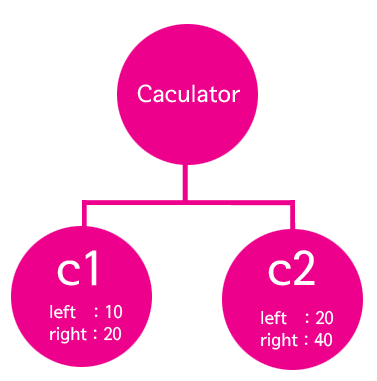

# 6강 - Introduction to Machine Learning

## 0. Advanced Python - Reshape

reshape\(\) 메소드의 경우 np.reshape\( array, dimension\) 또는 array.reshape\(dimension\) 과 같은 구문으로 사용할 수 있습니다. 배열의 차원을 변경할때 사용합니다. 

1\) 먼저 1차원의 배열입니다. 

```python
import numpy as np
a = [1,2,3,4,5,6,7,8]
b = np.reshape(a,(2,4))
c = np.reshape(a,(4,2))
print(b)
print('\n')
print(c)
```

```python
[[1 2 3 4]
 [5 6 7 8]]


[[1 2]
 [3 4]
 [5 6]
 [7 8]]
```

2차원의 경우 가로로 행이 먼저 대괄호로 닫혀있고 그 대괄호가 세로로 이어져 있는 만큼이 행벡터의 갯수. 가장 안쪽 대괄호의 element 갯수가 열벡터의 개수입니다. 

2\) 3차원으로도 변환할 수 있습니다. 

```python
a = np.arange(1,9)
b = a.reshape(2,2,2)
b
```

```python
array([[[1, 2],
        [3, 4]],

       [[5, 6],
        [7, 8]]])
```

```python
b[0]
```

```python
array([[1, 2],
       [3, 4]])
```

3차원에서 행렬을 접근 \(indexing\) 하려면 어떻게 해야할까요? 

```python
b[0][0,1]
```

```python
2
```

여기에는 정말 수많은 잘못된 정보들이 존재하는데요. 하나의 예시를 보겠습니다. 

```python
a = np.arange(0,24)
b = a.reshape(4,2,3)
b
```

예를 들어 봅시다. 

우리는 1차원 배열을 Vector라 하고,   
2차원 배열을 Matrix라 하며,  
3차원 배열을 Tensor라고 합니다. 

```python
array([[[ 0,  1,  2],
        [ 3,  4,  5]],

       [[ 6,  7,  8],
        [ 9, 10, 11]],

       [[12, 13, 14],
        [15, 16, 17]],

       [[18, 19, 20],
        [21, 22, 23]]])
```

우선 출력은 위 같습니다.   
그렇다면 해당 Tensor 는 4 행 2열의 깊이 3 짜리 tensor 일까요?  
또는 2행 3열의 깊이 4짜리 행렬일까요. 

혹자들은 이렇게 설명합니다. 


Figure 1을 보시면 우리가 흔히 생각하는 것과는 달리 각 matrix를 행으로 치고 기존의 행이라고 생각되던 것을 column이라 칭하는 것을 볼 수 있습니다. 공신력 높은 사이트에서도 이렇게 표기된 것을 볼 수 있는데요. 저는 단지 지적 허영에 불과하다고 생각합니다. 

만약 이게 사실이라면, 

```python
a = np.arange(0,24)
b = a.reshape(4,2,3)
b[0]
```

```text
array([[0, 1, 2],
       [3, 4, 5]])
```

뻔히 2행 3열짜리 행렬을 가지고, '4짜리 행이 없어졌으니 2열 과 깊이 3이 남은거야!' 라고 할건가요? 어림도 없죠! 

Tensorflow의 공식 문서에 다음과 같이 나와 있습니다.

```python
for image_batch, labels_batch in train_ds:
  print(image_batch.shape)
  print(labels_batch.shape)
  break
```

```python
(32, 180, 180, 3)
(32,)
```

 `image_batch`는 형상 `(32, 180, 180, 3)`의 텐서입니다. 이것은 형상 `180x180x3`의 32개 이미지 배치입니다\(마지막 치수는 색상 채널 RGB를 나타냄\). `label_batch`는 형상 `(32,)`의 텐서이며 32개 이미지에 해당하는 레이블입니다.

이미지 예시는 아래와 같습니다. 


자, 그럼 이게 \(9, 180, 180, 3\) 일때,  180by 180의 RGB 9장의 그림이지, 180장의 그림입니까?

축은 다양한 dimension으로 출력하기에 나름인 것이지 이것에 이름을 붙여서 부르는 것은 옳지 않습니다. 차라리 intuitive한 방법으로는 

```python
a = np.arange(0,24)
b = a.reshape(4,2,3)
b
```

```python
array([[[ 0,  1,  2],
        [ 3,  4,  5]],

       [[ 6,  7,  8],
        [ 9, 10, 11]],

       [[12, 13, 14],
        [15, 16, 17]],

       [[18, 19, 20],
        [21, 22, 23]]])
```

4짜리 깊이의 2by 3 행렬들이라고 생각하는게 직관적이지요. 

그러면, 한 번 합해보겠습니다. 

```python
array(
    [[[1,2,3,4],
    [5,6,7,8],
    [9,10,11,12]],

    [[13,14,15,16],
    [17,18,19,20],
    [21,22,23,24]]])
    
res0=t.sum(axis=0)
res0.shape
```

```python
(3, 4)

res0
```

```python
array(
    [14,16,18,20],
    [22,24,26,28],
    [30,32,34,36])
```

네 axis=0이 이전의 Matrix일 때와는 달리 각 Matrix를 indexing 하는 '깊이'와 같은 축이 되었으므로 각 'row'와 'column'에 대해서 합하는 것을 볼 수 있습니다. 

```python
array(
    [[[1,2,3,4],
    [5,6,7,8],
    [9,10,11,12]],

    [[13,14,15,16],
    [17,18,19,20],
    [21,22,23,24]]])
```

```python
res1=t.sum(axis=1)  

res1.shape
(2, 4)
```

```python
res1
array(
    [[15,18,21,24],
    [51,54,57,60]])
```

자, 여기서 부터는 axis=1 이므로 행기준 합계로서, 행끼리 더해주고 \(2,3,4\)에서 axis=1 이니 두번째의 3이 사라지고 \(2,4\)의 shape으로 합쳐주면 됩니다. 한 번만 더 해볼까요?

```python
array(
    [[[1,2,3,4],
    [5,6,7,8],
    [9,10,11,12]],

    [[13,14,15,16],
    [17,18,19,20],
    [21,22,23,24]]])
```

```python
res2=t.sum(axis=2) 

res2.shape
(2, 3)
```

```python
res2
array(
    [[10,26,42],
    [58,74,90]])
```

이제 차원의 고정관념에서 벗어나 봅시다. 기존 tensor의 shape이 \(2,3,4\) 였는데요. axis=2인 4성분을 제외하면. 각 4개씩 있던 성분들을 합쳐주고. 첫번째 두번째 벡터를 기준으로 내려주시면 되겠습니다. \(대괄호를 깐다고 생각합시다.\) 

출처: [https://www.tensorflow.org/tutorials/load\_data/images](https://www.tensorflow.org/tutorials/load_data/images) 에서 Tensorflow 공식 문서 참조하였습니다.   
[http://taewan.kim/post/numpy\_sum\_axis/](http://taewan.kim/post/numpy_sum_axis/) 블로그에서 tensor를 다루는 모형을 참조하였습니다.   
[https://wiserloner.tistory.com/956](https://wiserloner.tistory.com/956) 에서 sum 하는 예시를 가져왔습니다.   
[https://rfriend.tistory.com/290](https://rfriend.tistory.com/290) 에서 numpy array reshaping 의 예시를 참조하였습니다.

## 1. K-Nearest Neighbor Classification


## 2. Robustness


## 3. Advanced Python - Objects

우리가 지금까지 df나 knn과 같은 객체들을 사용해왔습니다. 사실 객체지향, 절차형, 함수형 프로그래밍 패러다임들을 이해하는 것이 근본적으로는 제일 중요한데요. 제가 잘 모릅니다 :\) . 전공자들 중에서도 프로그래밍 언어론, 소프트웨어 공학 쪽을 전공하신 분들이 정확히 알고 계시는 분야입니다만. 한번, 어떤 개념인지는 보고 가겠습니다. 

객체지향에는 5가지 키워드가 있습니다.  
  
1\) 클래스, 인스턴스 \(객체\)  
2\) 추상화  
3\) 캡슐화  
4\) 상속  
5\) 다형성

이 중 5번 다형성에는 오버로딩과 오버라이딩이 포함되는데요. 이전 강의에서 다뤘던 내용입니다.

그리고 이번에는 1\) 클래스와 인스턴스, 그리고 4\) 상속에 대해서 이야기해 보도록하겠습니다. 


클래스: 설계도   
인스턴스: 제품



각 패러다임을 선택해서 '난 객체지향 패러다임을 이용해서 프로그래밍을 할거야!'라는 식으로 이야기하지는 않습니다. 예를 들어, 사람끼리 대화할때에도 '나는 두괄식 화법을 사용할거야.'라고 생각해서 발화하지 않는 것처럼 말입니다. 각 패러다임을 이해하고 좋은 방향을 선택해서 프로그래밍을 계획할 수 있는 능력이 중요하겠습니다. 

출처: [https://opentutorials.org/course/2517/14041](https://opentutorials.org/course/2517/14041) 에서 인스턴스에 대한 설명을 참조하였습니다.

## 4. Assignment Guidance 

 첫번째 문제는, `cancer.data` 에 feature들이 있고. `cancer.target`에 label 이 있는데 이를 `concat()`하라는 것입니다. attribute를 추가하는 것이니 axis는 1이 적당하겠습니다. 그냥 `concat()`하면 이어지는 attribute의 이름을 지정하지 않을 경우 0, 1, 2등의 숫자로 들어가게 되니. `cancerdf.columns = np.append` 구문 통해서 'target'이라고 이름을 지정해 주는 것도 좋습니다. 

```python
def answer_one():
    # Your code here
    
    return # Return your answer
answer_one()
```

두번째는, dataframe에서 maligant는 0이고 benign한 그룹은 1로 마킹되어있는 target label에서 각각의 수를 세서 maligant와 benign을 index로 하는 프레임을 리턴해 달라는 것입니다. 뭐, 각각 마스킹해서 카운팅 해도 되고 `value_counts()`라는 메소드를 사용하셔도 되는데 방법은 많습니다. 

```python
def answer_two():
    cancerdf = answer_one()
    
    # Your code here
    
    return # Return your answer


answer_two()
```

세번째는, 본격적으로 feature X와 label y를 구분합니다. 기존으 데이터 프레임에서 마지막 target attribute를 drop해서 y에 가져오면 이것이 라벨입니다. \(왜 굳이 합쳤다 붙였다 하는지 똥개훈련인가.\)

```python
def answer_three():
    cancerdf = answer_one()
    
    # Your code here
    
    return X, y
```

네번째가 메인이라고 할 수 있습니다. training set과 test set을 분리하는 것인데요. train\_test\_split\(\) 메소드를 import하셔서 사용하시면 됩니다. random seed같은 경우는 0을 사용하라고 명시되어 있네요. 

다시 한 번 언급하자면,   
x는 feature, y는 label 그리고 각각을   
train set과 test set으로 구분하는 겁니다.   
예를 들어 x\_test 라면 test할때 예측에 사용되는 feature 겠지요? 

```python
from sklearn.model_selection import train_test_split

def answer_four():
    X, y = answer_three()
    
    # Your code here
    
    return X_train, X_test, y_train, y_test
```

다섯번째의 경우에는 4번에서 분리한 set을 가지고 실제로 KNeighborsClassifier\(\) 메소드를 통해 knn 인스턴스를 생성할 것입니다. neighbor는 1으로 하라고 명시되어 있네요. 

```python
from sklearn.neighbors import KNeighborsClassifier

def answer_five():
    X_train, X_test, y_train, y_test = answer_four()
    
    # Your code here
    
    return # Return your answer
```

여섯번째는 평균을 구해서 평균만큼 넣었을때 어떤 라벨로 예측할지 해보라는 것인데요. knn인스턴스에 `predict()`메소드를 사용하시면 되고. mean을 구할 array같은 경우는 오늘 수업에서 `reshape()`에 대한 설명을 했습니다.

```python
def answer_six():
    cancerdf = answer_one()
    means = cancerdf.mean()[:-1].values.reshape(1, -1)
    
    # Your code here
    
    return # Return your answer
```

일곱번째는 test set을 가지고 실제로 어떻게 예측을 해내는지 보는 것입니다. 이렇게 예측을 한다음 결과물을 가지고 test set y랑 비교해서 점수를 내면 그게 모델 평가가 되겠지요?

```python
def answer_seven():
    X_train, X_test, y_train, y_test = answer_four()
    knn = answer_five()
    
    # Your code here
    
    return # Return your answer
```

여덟번째가 바로 이 과정을 해보는 겁니다. knn인스턴스의 score\(\) 메소드를 사용하시면 됩니다. 

```python
def answer_eight():
    X_train, X_test, y_train, y_test = answer_four()
    knn = answer_five()
    
    # Your code here
    
    return # Return your answer
```

마지막 plot 해보는 예시가 있는데요. 실제 보고서에 넣을때 쓸만한 plotting 기능들인데 원래 수강 목표에 있었던 2번째 강의 \(Applied Plotting, Charting & Data Representation in Python\) 가 해당 내용을 다룹니다. 하지만, 뭐 결국 실험자체가 중요한거니까. 여기서도 그냥 코드를 다 줘서 실행만 시켜보면 됩니다. **꼭 확인할 거에요!!** 

```python
def accuracy_plot():
    import matplotlib.pyplot as plt

    %matplotlib notebook

    X_train, X_test, y_train, y_test = answer_four()

    # Find the training and testing accuracies by target value (i.e. malignant, benign)
    mal_train_X = X_train[y_train==0]
    mal_train_y = y_train[y_train==0]
    ben_train_X = X_train[y_train==1]
    ben_train_y = y_train[y_train==1]

    mal_test_X = X_test[y_test==0]
    mal_test_y = y_test[y_test==0]
    ben_test_X = X_test[y_test==1]
    ben_test_y = y_test[y_test==1]

    knn = answer_five()

    scores = [knn.score(mal_train_X, mal_train_y), knn.score(ben_train_X, ben_train_y), 
              knn.score(mal_test_X, mal_test_y), knn.score(ben_test_X, ben_test_y)]


    plt.figure()

    # Plot the scores as a bar chart
    bars = plt.bar(np.arange(4), scores, color=['#4c72b0','#4c72b0','#55a868','#55a868'])

    # directly label the score onto the bars
    for bar in bars:
        height = bar.get_height()
        plt.gca().text(bar.get_x() + bar.get_width()/2, height*.90, '{0:.{1}f}'.format(height, 2), 
                     ha='center', color='w', fontsize=11)

    # remove all the ticks (both axes), and tick labels on the Y axis
    plt.tick_params(top='off', bottom='off', left='off', right='off', labelleft='off', labelbottom='on')

    # remove the frame of the chart
    for spine in plt.gca().spines.values():
        spine.set_visible(False)

    plt.xticks([0,1,2,3], ['Malignant\nTraining', 'Benign\nTraining', 'Malignant\nTest', 'Benign\nTest'], alpha=0.8);
    plt.title('Training and Test Accuracies for Malignant and Benign Cells', alpha=0.8)
```

##  5. Schedule

~~Jan 26th, 27th~~   
Introduction week1 + assignment 1 due to Feb 2nd  
~~Feb 2nd,  3rd~~   
Introduction week2 + assignment 2 due to Feb 9th  
~~Feb 9th, 10th~~ Machine Learning  
Machine Learning week1 + assignment 1 due to Feb 16th

다음주가 텍스트 마이닝으로 넘어갈 예정인데요. 일정에 따라서 다음주 한주 머신러닝에 관련한 수학적 내용을 한번 더 다룰 수 도 있습니다. 의견있으시면 언제든지 주세요!    
Feb 16th, 17th Text Mining  
Machine Learning week 1 + assignment 2 due to Feb 24th  
Feb 23th, 24th Text Mining  
Text Mining week 2 + there's no assignment


