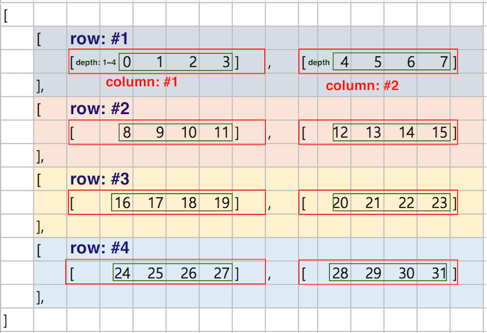

# 6강 - Introduction to Machine Learning

## 0. Reshape

reshape\(\) 메소드의 경우 np.reshape\( array, dimension\) 또는 array.reshape\(dimension\) 과 같은 구문으로 사용할 수 있습니다. 배열의 차원을 변경할때 사용합니다. 

1\) 먼저 1차원의 배열입니다. 

```python
import numpy as np
a = [1,2,3,4,5,6,7,8]
b = np.reshape(a,(2,4))
c = np.reshape(a,(4,2))
print(b)
print('\n')
print(c)
```

```python
[[1 2 3 4]
 [5 6 7 8]]


[[1 2]
 [3 4]
 [5 6]
 [7 8]]
```

2차원의 경우 가로로 행이 먼저 대괄호로 닫혀있고 그 대괄호가 세로로 이어져 있는 만큼이 행벡터의 갯수. 가장 안쪽 대괄호의 element 갯수가 열벡터의 개수입니다. 

2\) 3차원으로도 변환할 수 있습니다. 

```python
a = np.arange(1,9)
b = a.reshape(2,2,2)
b
```

```python
array([[[1, 2],
        [3, 4]],

       [[5, 6],
        [7, 8]]])
```

```python
b[0]
```

```python
array([[1, 2],
       [3, 4]])
```

3차원에서 행렬을 접근 \(indexing\) 하려면 어떻게 해야할까요? 

```python
b[0][0,1]
```

```python
2
```

여기에는 정말 수많은 잘못된 정보들이 존재하는데요. 하나의 예시를 보겠습니다. 

```python
a = np.arange(0,24)
b = a.reshape(4,2,3)
b
```

예를 들어 봅시다. 

우리는 1차원 배열을 Vector라 하고,   
2차원 배열을 Matrix라 하며,  
3차원 배열을 Tensor라고 합니다. 

```python
array([[[ 0,  1,  2],
        [ 3,  4,  5]],

       [[ 6,  7,  8],
        [ 9, 10, 11]],

       [[12, 13, 14],
        [15, 16, 17]],

       [[18, 19, 20],
        [21, 22, 23]]])
```

우선 출력은 위 같습니다.   
그렇다면 해당 Tensor 는 4 행 2열의 깊이 3 짜리 tensor 일까요?  
또는 2행 3열의 깊이 4짜리 행렬일까요. 

혹자들은 이렇게 설명합니다. 



Figure 1을 보시면 우리가 흔히 생각하는 것과는 달리 각 matrix를 행으로 치고 기존의 행이라고 생각되던 것을 column이라 칭하는 것을 볼 수 있습니다. 공신력 높은 사이트에서도 이렇게 표기된 것을 볼 수 있는데요. 저는 단지 지적 허영에 불과하다고 생각합니다. 

만약 이게 사실이라면, 

```python
a = np.arange(0,24)
b = a.reshape(4,2,3)
b[0]
```

```text
array([[0, 1, 2],
       [3, 4, 5]])
```

뻔히 2행 3열짜리 행렬을 가지고, '4짜리 행이 없어졌으니 2열 과 깊이 3이 남은거야!' 라고 할건가요? 어림도 없죠! 

Tensorflow의 공식 문서에 다음과 같이 나와 있습니다.

```python
for image_batch, labels_batch in train_ds:
  print(image_batch.shape)
  print(labels_batch.shape)
  break
```

```python
(32, 180, 180, 3)
(32,)
```

 `image_batch`는 형상 `(32, 180, 180, 3)`의 텐서입니다. 이것은 형상 `180x180x3`의 32개 이미지 배치입니다\(마지막 치수는 색상 채널 RGB를 나타냄\). `label_batch`는 형상 `(32,)`의 텐서이며 32개 이미지에 해당하는 레이블입니다.

이미지 예시는 아래와 같습니다. 


자, 그럼 이게 \(9, 180, 180, 3\) 일때,  180by 180의 RGB 9장의 그림이지, 180장의 그림입니까?

축은 다양한 dimension으로 출력하기에 나름인 것이지 이것에 이름을 붙여서 부르는 것은 옳지 않습니다. 차라리 intuitive한 방법으로는 

```python
a = np.arange(0,24)
b = a.reshape(4,2,3)
b
```

```python
array([[[ 0,  1,  2],
        [ 3,  4,  5]],

       [[ 6,  7,  8],
        [ 9, 10, 11]],

       [[12, 13, 14],
        [15, 16, 17]],

       [[18, 19, 20],
        [21, 22, 23]]])
```

4짜리 깊이의 2by 3 행렬들이라고 생각하는게 직관적이지요. 

그러면, 한 번 합해보겠습니다. 

```python
array(
    [[[1,2,3,4],
    [5,6,7,8],
    [9,10,11,12]],

    [[13,14,15,16],
    [17,18,19,20],
    [21,22,23,24]]])
    
res0=t.sum(axis=0)
res0.shape
```

```python
(3, 4)

res0
```

```python
array(
    [14,16,18,20],
    [22,24,26,28],
    [30,32,34,36])
```

네 axis=0이 이전의 Matrix일 때와는 달리 각 Matrix를 indexing 하는 '깊이'와 같은 축이 되었으므로 각 'row'와 'column'에 대해서 합하는 것을 볼 수 있습니다. 

```python
array(
    [[[1,2,3,4],
    [5,6,7,8],
    [9,10,11,12]],

    [[13,14,15,16],
    [17,18,19,20],
    [21,22,23,24]]])
```

```python
res1=t.sum(axis=1)  

res1.shape
(2, 4)
```

```python
res1
array(
    [[15,18,21,24],
    [51,54,57,60]])
```

자, 여기서 부터는 axis=1 이므로 행기준 합계로서, 행끼리 더해주고 \(2,3,4\)에서 axis=1 이니 두번째의 3이 사라지고 \(2,4\)의 shape으로 합쳐주면 됩니다. 한 번만 더 해볼까요?

```python
array(
    [[[1,2,3,4],
    [5,6,7,8],
    [9,10,11,12]],

    [[13,14,15,16],
    [17,18,19,20],
    [21,22,23,24]]])
```

```python
res2=t.sum(axis=2) 

res2.shape
(2, 3)
```

```python
res2
array(
    [[10,26,42],
    [58,74,90]])
```

이제 차원의 고정관념에서 벗어나 봅시다. 기존 tensor의 shape이 \(2,3,4\) 였는데요. axis=2인 4성분을 제외하면. 각 4개씩 있던 성분들을 합쳐주고. 첫번째 두번째 벡터를 기준으로 내려주시면 되겠습니다. \(대괄호를 깐다고 생각합시다.\) 

출처: [https://www.tensorflow.org/tutorials/load\_data/images](https://www.tensorflow.org/tutorials/load_data/images) 에서 Tensorflow 공식 문서 참조하였습니다.   
[http://taewan.kim/post/numpy\_sum\_axis/](http://taewan.kim/post/numpy_sum_axis/) 블로그에서 tensor를 다루는 모형을 참조하였습니다.   
[https://wiserloner.tistory.com/956](https://wiserloner.tistory.com/956) 에서 sum 하는 예시를 가져왔습니다.   
[https://rfriend.tistory.com/290](https://rfriend.tistory.com/290) 에서 numpy array reshaping 의 예시를 참조하였습니다.

## 1. Classifier, Regression, Prediction

기본적으로 머신러닝에서는 통계학과 컴퓨터공학, 마지막으로 프로젝트에 사용할 사회과학적 개념과 데이터를 많이 활용합니다. 하지만, 기본적으로 공학적인 시각을 가진 문제 해결 방법으라고 할 수 있는데요. 사회과학에서의 문제해결방법과 어떻게 다른지. 

머신러닝의 대표적인 활용 방향인 Classifier와 Regression, Prediction을 예시로 설명하겠습니다. 

## 2. K-Nearest Neighbor Classification


## 3. Robustness


## 4. Advanced Python - Objects

우리가 지금까지 df나 knn과 같은 객체들을 사용해왔습니다. 사실 객체지향, 절차형, 함수형 프로그래밍 패러다임들을 이해하는 것이 근본적으로는 제일 중요한데요. 제가 잘 모릅니다 :\) . 전공자들 중에서도 프로그래밍 언어론, 소프트웨어 공학 쪽을 전공하신 분들이 정확히 알고 계시는 분야입니다만. 한번, 어떤 개념인지는 보고 가겠습니다. 

그림을 통해 설명합니다. 

## 5. Advanced Python - reshaping array


