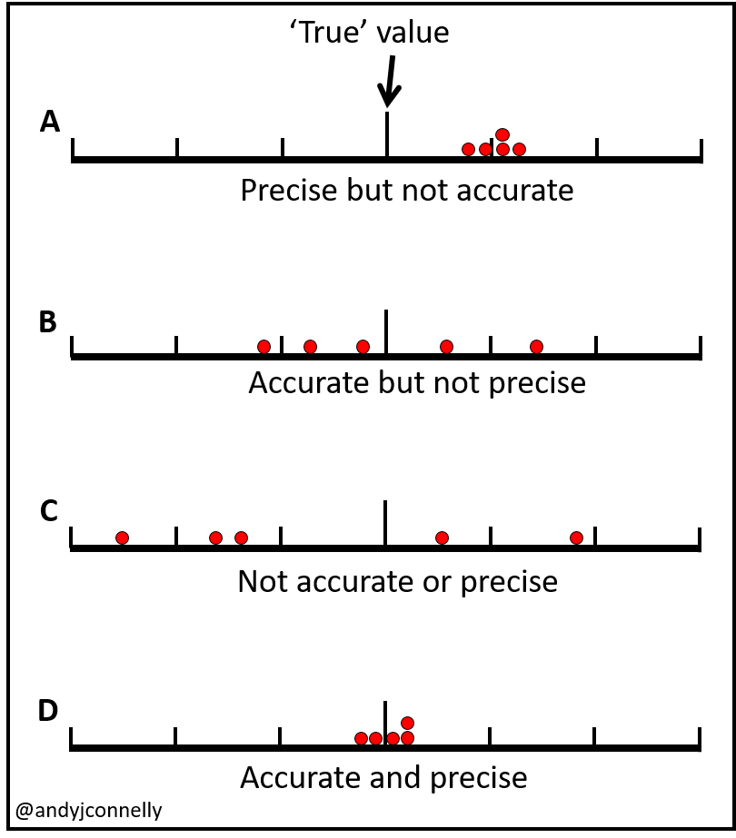

# 7강 - Experimental Design of Machine Learning Project

## 0. assignment review

```python
import numpy as np
import pandas as pd
from sklearn.datasets import load_breast_cancer

cancer = load_breast_cancer()

#print(cancer.DESCR) # Print the data set description
```

```python
def answer_one():
    columns = ['mean radius', 'mean texture', 'mean perimeter', 'mean area',
    'mean smoothness', 'mean compactness', 'mean concavity',
    'mean concave points', 'mean symmetry', 'mean fractal dimension',
    'radius error', 'texture error', 'perimeter error', 'area error',
    'smoothness error', 'compactness error', 'concavity error',
    'concave points error', 'symmetry error', 'fractal dimension error',
    'worst radius', 'worst texture', 'worst perimeter', 'worst area',
    'worst smoothness', 'worst compactness', 'worst concavity',
    'worst concave points', 'worst symmetry', 'worst fractal dimension',
    'target']
    index = range(0, 569, 1)
#   print(cancer['data'].shape)
    df = pd.DataFrame(data=cancer['data'], index=index, columns = columns[:30])
#   print(cancer['target'])
    df['target'] = cancer['target']
    return df

answer_one()
```

```python
def answer_two():
    cancerdf = answer_one()
    malignant_count = len(cancerdf[cancerdf['target'] == 0])
    benign_count = len(cancerdf[cancerdf['target'] == 1])
    
    index = ['malignant', 'benign']
    target = pd.Series(data=[malignant_count, benign_count], index=index)
    return target
answer_two()
```

```python
def answer_three():
    cancerdf = answer_one()
    X = cancerdf.iloc[:,:30]
    y = cancerdf.iloc[:,30:32].values.ravel()
#     y = cancerdf['target']
#    y = cancerdf.target
#     print(y)
    return X, y

answer_three()
```

```python
from sklearn.model_selection import train_test_split

def answer_four():
    X, y = answer_three()
    X_train, X_test, y_train, y_test = train_test_split(X, y, random_state=0)
    return X_train, X_test, y_train, y_test
answer_four()
```

```python
from sklearn.neighbors import KNeighborsClassifier

def answer_five():
    X_train, X_test, y_train, y_test = answer_four()
    
    # Your code here
    knn = KNeighborsClassifier(n_neighbors = 1)
    knn.fit(X_train, y_train)
    return knn
answer_five()
```

```python
def answer_six():
    cancerdf = answer_one()
    knn = answer_five()
    means = (cancerdf.mean()[:-1].values.reshape(1, -1))
#   print(means.shape)
    # Your code here
    prediction = knn.predict(means)
    answer = np.array(prediction)
    return answer
answer_six()
```

```python
def answer_seven():
    X_train, X_test, y_train, y_test = answer_four()
    knn = answer_five()   
    prediction = knn.predict(X_test)
    answer = np.array(prediction)
    return answer
answer_seven()
```

```python
def answer_eight():
    X_train, X_test, y_train, y_test = answer_four()
    knn = answer_five()
    answer = knn.score(X_test, y_test)
    return answer
answer_eight()
```

```python
def accuracy_plot():
    import matplotlib.pyplot as plt

    %matplotlib notebook

    X_train, X_test, y_train, y_test = answer_four()

    # Find the training and testing accuracies by target value (i.e. malignant, benign)
    mal_train_X = X_train[y_train==0]
    mal_train_y = y_train[y_train==0]
    ben_train_X = X_train[y_train==1]
    ben_train_y = y_train[y_train==1]

    mal_test_X = X_test[y_test==0]
    mal_test_y = y_test[y_test==0]
    ben_test_X = X_test[y_test==1]
    ben_test_y = y_test[y_test==1]

    knn = answer_five()

    scores = [knn.score(mal_train_X, mal_train_y), knn.score(ben_train_X, ben_train_y), 
              knn.score(mal_test_X, mal_test_y), knn.score(ben_test_X, ben_test_y)]


    plt.figure()

    # Plot the scores as a bar chart
    bars = plt.bar(np.arange(4), scores, color=['#4c72b0','#4c72b0','#55a868','#55a868'])

    # directly label the score onto the bars
    for bar in bars:
        height = bar.get_height()
        plt.gca().text(bar.get_x() + bar.get_width()/2, height*.90, '{0:.{1}f}'.format(height, 2), 
                     ha='center', color='w', fontsize=11)

    # remove all the ticks (both axes), and tick labels on the Y axis
    plt.tick_params(top='off', bottom='off', left='off', right='off', labelleft='off', labelbottom='on')

    # remove the frame of the chart
    for spine in plt.gca().spines.values():
        spine.set_visible(False)

    plt.xticks([0,1,2,3], ['Malignant\nTraining', 'Benign\nTraining', 'Malignant\nTest', 'Benign\nTest'], alpha=0.8);
    plt.title('Training and Test Accuracies for Malignant and Benign Cells', alpha=0.8)
```

## 1. Precision and Accuracy

independant - feature  
dependent - label



출처 : [https://andyjconnelly.wordpress.com/2017/05/15/accuracy-and-precision/](https://andyjconnelly.wordpress.com/2017/05/15/accuracy-and-precision/)  


