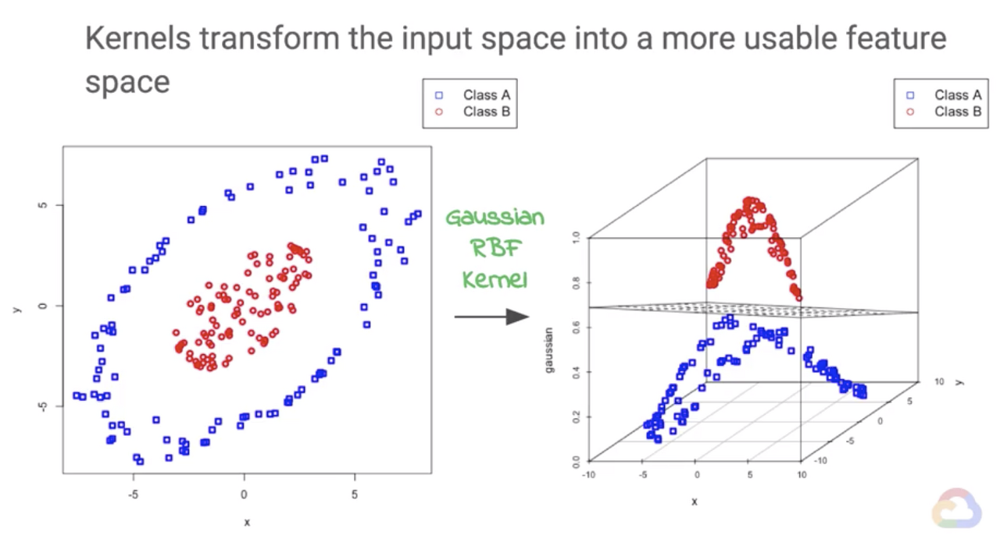

# 7강 - Experimental Design of Machine Learning Project

## 0. assignment review

```python
import numpy as np
import pandas as pd
from sklearn.datasets import load_breast_cancer

cancer = load_breast_cancer()

#print(cancer.DESCR) # Print the data set description
```

이주에는 데이터를 로컬에서 불러오는 것이 아니라. sklearn.datasets에서 가져올 것입니다. load-breast-cancer\(\)를 통해 데이터를 가져와서 cancer에 저장할게요.

```python
def answer_one():
    columns = ['mean radius', 'mean texture', 'mean perimeter', 'mean area',
    'mean smoothness', 'mean compactness', 'mean concavity',
    'mean concave points', 'mean symmetry', 'mean fractal dimension',
    'radius error', 'texture error', 'perimeter error', 'area error',
    'smoothness error', 'compactness error', 'concavity error',
    'concave points error', 'symmetry error', 'fractal dimension error',
    'worst radius', 'worst texture', 'worst perimeter', 'worst area',
    'worst smoothness', 'worst compactness', 'worst concavity',
    'worst concave points', 'worst symmetry', 'worst fractal dimension',
    'target']
    index = range(0, 569, 1)
#   print(cancer['data'].shape)
    df = pd.DataFrame(data=cancer['data'], index=index, columns = columns[:30])
#   print(cancer['target'])
    df['target'] = cancer['target']
    return df

answer_one()
```

column을 친절하게도 다 줬습니다. \(attribute라고 명명하는게 더 정확하겠죠? 찡긋\) 그래서 column들은 그대로 넣으시면 되고 데이터는 `cancer['data']`에 있는 것들 넣고 index는 주어진대로 정리하는 식으로.

한마디로 데이터를 불러와서 내가 할 연구의 틀에 맞 잘라내는 과정입니다. 

```python
def answer_two():
    cancerdf = answer_one()
    malignant_count = len(cancerdf[cancerdf['target'] == 0])
    benign_count = len(cancerdf[cancerdf['target'] == 1])
    
    index = ['malignant', 'benign']
    target = pd.Series(data=[malignant_count, benign_count], index=index)
    return target
answer_two()
```

맨날하던거에요, 카운팅 하면 됩니다. `count()`를 쓰셔도 되고 masking후 series 길이 구하셔도 됩니다.

```python
def answer_three():
    cancerdf = answer_one()
    X = cancerdf.iloc[:,:30]
    y = cancerdf.iloc[:,30:32].values.ravel()
#     y = cancerdf['target']
#    y = cancerdf.target
#     print(y)
    return X, y

answer_three()
```

x, 레코드들은 \(행\) 그대로 두고 \(:\) y의 attribute들만 30번까지, 그리고 target으로 나누는 겁니다. 

```python
from sklearn.model_selection import train_test_split

def answer_four():
    X, y = answer_three()
    X_train, X_test, y_train, y_test = train_test_split(X, y, random_state=0)
    return X_train, X_test, y_train, y_test
answer_four()
```

이제 데이터를 다 정리 했으면 X\(feature set\)와 y\(label set\)을 각각 train과 test로도 분리 해줍니다. 그러니까 즉, train용 feature, train용 label과 test용 feature, test용 label이 나뉘는 것이죠!

```python
from sklearn.neighbors import KNeighborsClassifier

def answer_five():
    X_train, X_test, y_train, y_test = answer_four()
    
    # Your code here
    knn = KNeighborsClassifier(n_neighbors = 1)
    knn.fit(X_train, y_train)
    return knn
answer_five()
```

knn인스턴스를 만들어줍니다. 생성자 KNeighborsClassifier\(\)에 들어가는 옵션으로는 대표적으로 n\_neihbors가 있겠네요. 1로하셔도 되고 바꿔보셔도 됩니다 ㅎㅎ

fit\(\)에는 항상 train이 들어가는데요. 당연히 fitting할때는 training set으로 해야겠죠?

```python
def answer_six():
    cancerdf = answer_one()
    knn = answer_five()
    means = (cancerdf.mean()[:-1].values.reshape(1, -1))
#   print(means.shape)
    # Your code here
    prediction = knn.predict(means)
    answer = np.array(prediction)
    return answer
answer_six()
```

means는 지금 그냥 평균 구해놓은 건데. 문제 6번의 골자는 5번에서 피팅이 완료된 모델을 가지고 한번 아무 값이나 넣어서 예측을 한번 해보는 겁니다. 실제로 과일 분류기가 완성이 되었다면 아무거나 한번 넣어보는 식이죠. 이럴때는 predict\(\)를 씁니다. 

```python
def answer_seven():
    X_train, X_test, y_train, y_test = answer_four()
    knn = answer_five()   
    prediction = knn.predict(X_test)
    answer = np.array(prediction)
    return answer
answer_seven()
```

7번 문제의 경우 아무거나 한 번 넣어주는게 아니라 정식적으로 기존에 만들었던 test용 feature들을 넣어서 예측을 뽑아보는 겁니다.

```python
def answer_eight():
    X_train, X_test, y_train, y_test = answer_four()
    knn = answer_five()
    answer = knn.score(X_test, y_test)
    return answer
answer_eight()
```

8번과 7번을 잘 구분할 줄 아셔야 합니다. test용 label이 왜 들어가겠습니까? 점수 메겨야죠.

```python
def accuracy_plot():
    import matplotlib.pyplot as plt

    %matplotlib notebook

    X_train, X_test, y_train, y_test = answer_four()

    # Find the training and testing accuracies by target value (i.e. malignant, benign)
    mal_train_X = X_train[y_train==0]
    mal_train_y = y_train[y_train==0]
    ben_train_X = X_train[y_train==1]
    ben_train_y = y_train[y_train==1]

    mal_test_X = X_test[y_test==0]
    mal_test_y = y_test[y_test==0]
    ben_test_X = X_test[y_test==1]
    ben_test_y = y_test[y_test==1]

    knn = answer_five()

    scores = [knn.score(mal_train_X, mal_train_y), knn.score(ben_train_X, ben_train_y), 
              knn.score(mal_test_X, mal_test_y), knn.score(ben_test_X, ben_test_y)]


    plt.figure()

    # Plot the scores as a bar chart
    bars = plt.bar(np.arange(4), scores, color=['#4c72b0','#4c72b0','#55a868','#55a868'])

    # directly label the score onto the bars
    for bar in bars:
        height = bar.get_height()
        plt.gca().text(bar.get_x() + bar.get_width()/2, height*.90, '{0:.{1}f}'.format(height, 2), 
                     ha='center', color='w', fontsize=11)

    # remove all the ticks (both axes), and tick labels on the Y axis
    plt.tick_params(top='off', bottom='off', left='off', right='off', labelleft='off', labelbottom='on')

    # remove the frame of the chart
    for spine in plt.gca().spines.values():
        spine.set_visible(False)

    plt.xticks([0,1,2,3], ['Malignant\nTraining', 'Benign\nTraining', 'Malignant\nTest', 'Benign\nTest'], alpha=0.8);
    plt.title('Training and Test Accuracies for Malignant and Benign Cells', alpha=0.8)
```

## 1. Precision and Accuracy

independant - feature  
dependent - label


출처 : [https://andyjconnelly.wordpress.com/2017/05/15/accuracy-and-precision/](https://andyjconnelly.wordpress.com/2017/05/15/accuracy-and-precision/)  


## 2. parameter and hyperparameter

polynomial regression

$$
y = 0.5x² + x + 2
$$

parameter?

vs

hyperparameters ex\) learning rate, k at KNN, Cost at SVM


Kernel



출처 : [https://injo.tistory.com/34](https://injo.tistory.com/34)


