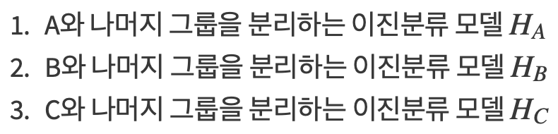
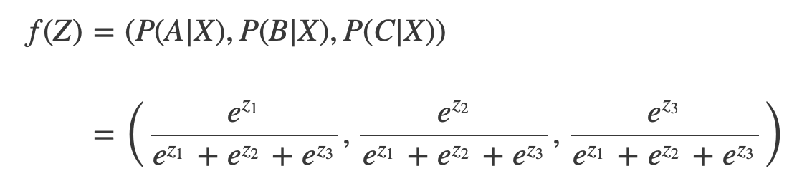
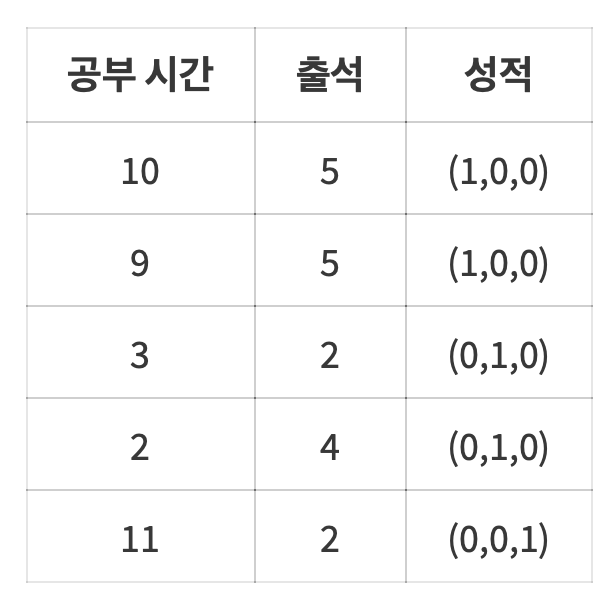
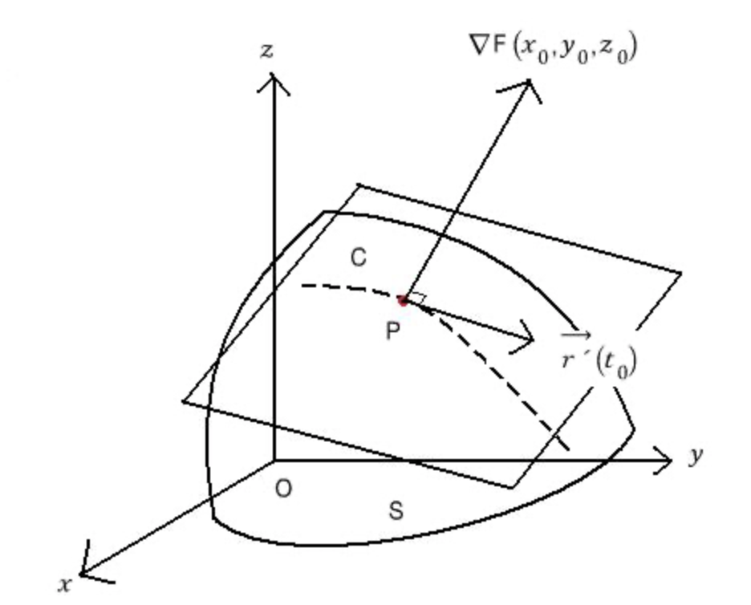
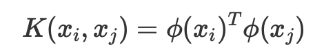

# 8강 - Soft Vector Machine

## 0. Logistic Regression

## 1. Multiclass classification

### One vs the rest 

softmax

One hot encoding

내용 출처: [https://mjgim.me/2018/03/26/multiclass\_mlp.html](https://mjgim.me/2018/03/26/multiclass_mlp.html)

## 2. Regularization

polynomial regression - Regularization  
이미지 각 상황에맞는 도로교통 -&gt; 각상황을 온라인으로 받는 regularization

KNN 은 예외였으나. supervised learning의 경우 학습이 진행될수록 fitting이 심해지는건 불변의 법칙이다.

&lt;-&gt; normalization \(precision, accuracy\)

출처 : [https://light-tree.tistory.com/125](https://light-tree.tistory.com/125) 댓글 없이 가져와서 죄송합니다..

## 3. Soft Vector Machine

마진 위에 있는 것들을 1로 아래있는 것들을 -1로. 

"마진이라는 트릭을 통해서 커널링을 활용하는 분류 방법"

$$
(𝑤_{1},𝑤_{2})^T
$$

을 2차원 벡터라 하면, 원점과의 거리가 b 인 직선의 방정식 

$$
w^Tx+b=w_1x_1+w_2x_2+b=0
$$

초평면 위에 있는 벡터 간의 관계를 λ 와 𝑤 로 나타내면,

plus 방향의 평면과 minus 방향의 평면의 margin \(distance\)를 구하면,

따라서, 문제가 다음과 같이 정의된다.

식을 정리하면, 

이제 고등학교 기하때 많이 활용했던 라그랑지 승수법을 적용해본다. 

이 식을 울프쌍대문제에 적용하고. 

KKT조건에 의하면. 

Mercer Theorem에 따라 커널 트릭이 적용 가능하다. 

출처: [https://ratsgo.github.io/machine%20learning/2017/05/23/SVM/](https://ratsgo.github.io/machine%20learning/2017/05/23/SVM/) 에서 전반적인 설명을 차용하였고. 커널 트릭의 경우  
[https://www.sallys.space/blog/2018/05/30/svm/](https://www.sallys.space/blog/2018/05/30/svm/) 를 참고하였습니다. 

